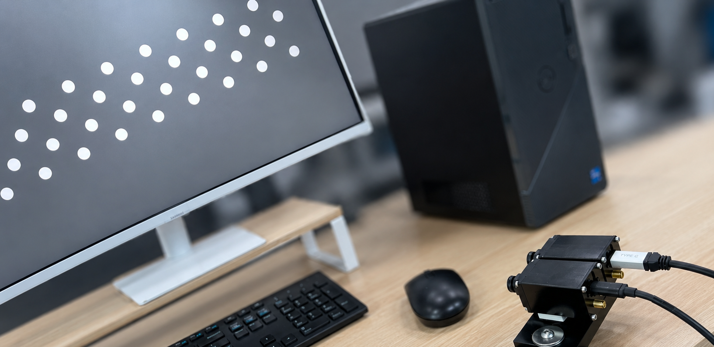
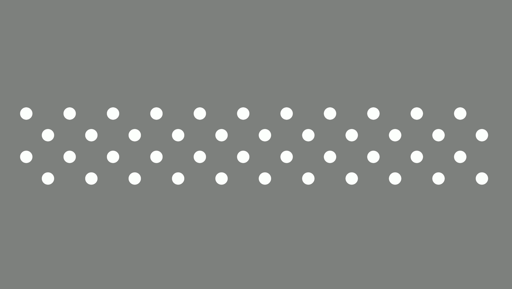
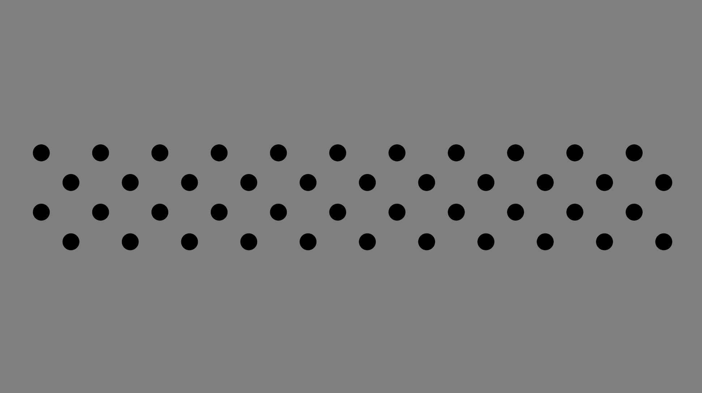
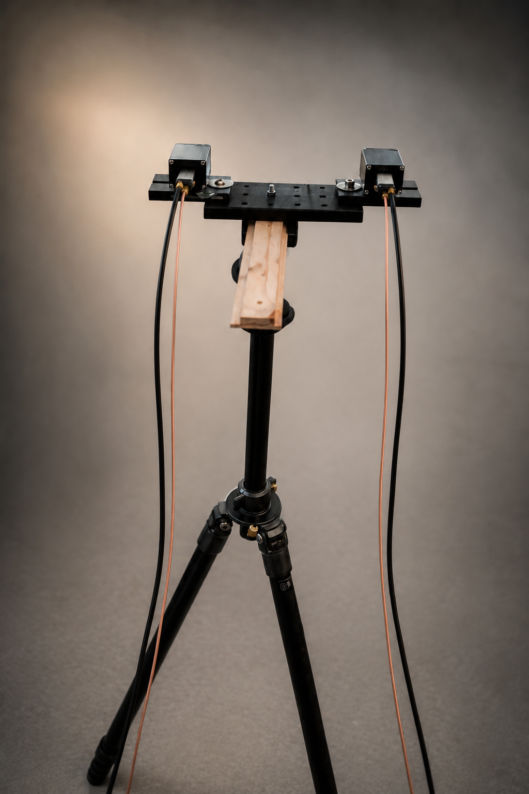
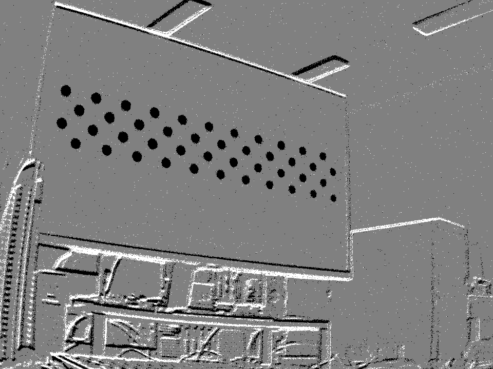
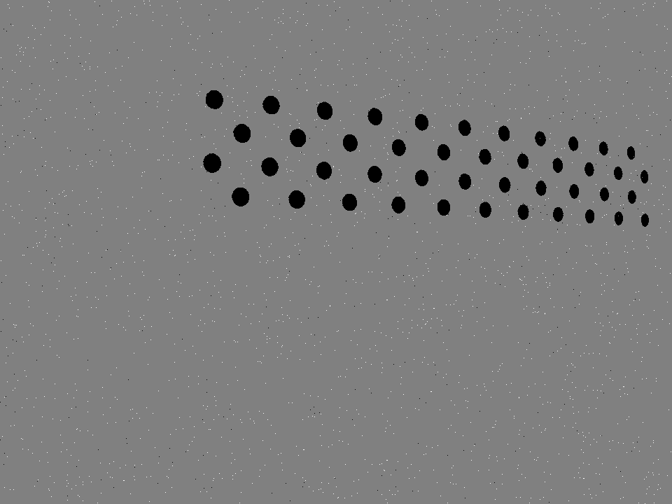
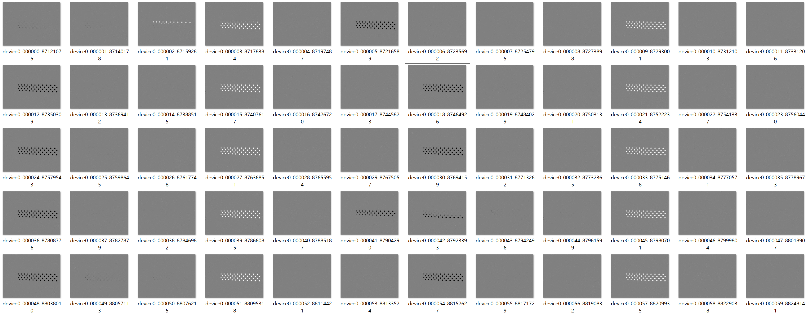

# [1]. Blinking Asymmetric Circle Grid for NRV DVS Calibration

NRV DVS 캘리브레이션을 위해 모니터에 blinking asymmetric circle grid를 띄우는 준비 코드입니다. 이후 캘리브레이션, 스테레오 매칭 까지 시리즈로 정리할 예정이며, 이 저장소는 그중 첫 번째 단계입니다.

메인 파일은 `circle_blink.py` 하나입니다. OpenCV로 전체화면 창을 만들고, asymmetric circle grid의 원들을 흰색과 검은색으로 번갈아 표시하여 DVS가 원 위치에서 이벤트를 만들 수 있게 합니다.

<p align="center">
  
</p>

아래처럼 모니터에 흰색 원과 검은색 원이 번갈아 나타나게 하고, NRV DVS가 모니터를 바라보도록 배치하여 circle grid 이벤트를 기록합니다.

<p align="center">
  
  
</p>

## 왜 Asymmetric Circle Grid인가

이벤트 카메라 캘리브레이션에서는 패턴의 점을 정확하게 잡는 것이 중요합니다. 이 코드에서는 checkerboard 대신 asymmetric circle grid를 사용합니다.

Asymmetric circle grid는 원형 점들이 떨어져 있기 때문에, 각 원에서 발생한 edge 이벤트들을 모아 중심을 계산할 수 있습니다. 원은 어느 방향에서 보아도 중심을 추정하기 좋고, 주변 edge를 종합해 circle center를 구할 수 있다는 장점이 있습니다.

Checkerboard를 이벤트 카메라에 사용하면 흰색과 검은색의 경계가 만드는 ON/OFF event의 교차점을 정확히 잡아야 합니다. 하지만 교차점은 여러 edge가 만나는 지점이라 이벤트가 복잡하게 섞이고, 카메라 움직임이나 모니터 refresh 상태에 따라 안정적으로 포착하기 어렵습니다.

반면 circle grid는 서로 떨어져 있는 원 하나하나를 독립적인 점으로 볼 수 있습니다. 밝은 원과 어두운 원을 blink시키면 각 원 주변에서 이벤트가 발생하고, 이 이벤트 묶음만 잘 포착하면 점 위치를 비교적 정확하게 얻을 수 있습니다.

또한 별도의 인쇄물이나 조명 장치를 준비하지 않고 모니터만 사용하면 되므로 준비 과정이 간단합니다. 이런 이유로 NRV DVS 캘리브레이션 준비 단계에서는 asymmetric circle grid를 사용하는 것이 좋습니다.

## 캘리브레이션 촬영 절차

1. 모니터에 `circle_blink.py`로 asymmetric circle grid를 전체화면으로 띄웁니다.

2. 아래 사진처럼 NRV DVS를 삼각대에 놓고 고정한 뒤, DVS가 모니터를 바라보게 한 상태에서 기록합니다.

<p align="center">
  
</p>

3. 촬영 중 카메라나 모니터가 흔들려 주변 물체까지 함께 보이면 문제가 생깁니다. 아래 왼쪽 사진처럼 주변 물체가 많이 검출되는 상황은 피하고, 오른쪽 사진처럼 모니터와 카메라가 정지된 상태에서 circle grid의 원들만 검출되는 상황을 유지하는 것이 이상적입니다.

<p align="center">
  
  
</p>

4. 기록이 끝나면 아래 사진처럼 전체 circle grid가 잘 나온 frame 또는 event slice를 직접 골라줍니다. 모니터와 카메라가 이상적으로 trigger되어 항상 딱 맞는 순간만 찍히지는 않기 때문에, 전체 grid가 선명하게 보이는 장면을 선택해야 합니다.



스테레오 DVS라면 두 디바이스에서 같은 pose의 grid를 골라야 합니다. 또한 두 장의 타이밍도 최대한 비슷한 구간으로 맞춰야 이후 stereo calibration과 matching에서 오차가 줄어듭니다.

5. 캘리브레이션에는 대략 50 pose 정도가 필요합니다. 안정적으로 진행하려면 50개 이상, 가능하면 70개 정도의 pose를 확보하는 것이 좋습니다.

## 코드 설명

`circle_blink.py`는 모니터에 띄울 blinking circle grid를 생성하는 단일 Python 파일입니다.

```python
screen_w = 3840
screen_h = 2160
```

표시할 모니터 해상도입니다. 4K 모니터 기준으로 작성되어 있으므로 사용하는 모니터 해상도에 맞게 바꿀 수 있습니다.

```python
cols = 11
rows = 4
```

비대칭 원 그리드의 열과 행 개수입니다. OpenCV의 asymmetric circle grid 검출이나 이후 캘리브레이션 설정에서도 이 개수와 같은 기준을 사용해야 합니다.

```python
spacing_px = 160
circle_diameter_px = 115
```

원 사이 간격과 원 지름입니다. DVS가 원 하나하나를 충분히 분리해서 볼 수 있도록, 모니터 크기와 카메라 거리 기준으로 조절합니다.

```python
bg_val = 128
bright_val = 255
dark_val = 0
```

배경은 중간 회색, 원은 흰색과 검은색으로 번갈아 표시합니다. 이렇게 하면 밝아지는 순간에는 ON event, 어두워지는 순간에는 OFF event가 발생합니다.

```python
fps = 60
toggle_every = 2
```

화면 갱신 기준은 60 fps이고, 원 색상은 2 frame마다 바뀝니다. 즉 모니터에서는 흰색 원과 검은색 원 상태가 번갈아 나타나며, DVS는 이 변화에서 circle grid 이벤트를 기록합니다.

```python
def make_points():
```

비대칭 circle grid의 점 위치를 만듭니다. 짝수 행과 홀수 행의 x 위치를 다르게 두어 asymmetric pattern을 만들고, 마지막에는 전체 패턴이 화면 중앙에 오도록 이동시킵니다.

```python
cv2.setWindowProperty(win, cv2.WND_PROP_FULLSCREEN, cv2.WINDOW_FULLSCREEN)
```

OpenCV 창을 전체화면으로 띄웁니다. 캘리브레이션 촬영 중에는 다른 UI가 보이지 않게 전체화면 상태를 유지하는 것이 좋습니다.

루프 안에서는 매 frame마다 회색 배경을 만들고, 모든 원을 현재 상태에 따라 흰색 또는 검은색으로 그린 뒤 화면에 보여줍니다. `q` 키를 누르면 종료됩니다.

## 실행 방법

Python 환경에서 OpenCV와 NumPy가 필요합니다.

```bash
pip install opencv-python numpy
```

실행은 아래처럼 합니다.

```bash
python circle_blink.py
```

실행 후 모니터가 전체화면으로 바뀌고 circle grid가 blink됩니다. 종료하려면 OpenCV 창이 활성화된 상태에서 `q`를 누릅니다.

## 파일 구성

```text
circle_blink.py
README.md
assets/
```

`circle_blink.py`가 실제 실행 코드이며, `assets` 폴더는 README 설명용 이미지입니다.

## 주의할 점

이 코드는 NRV DVS 캘리브레이션 데이터를 얻기 위한 준비 단계입니다. NRV 센서는 global shutter를 지원하기 때문에, 모니터에 표시된 circle grid 전체가 같은 pose로 잡히는 상황을 만들 수 있고 이 방식에 적합합니다.

다만 모니터 refresh, 운영체제의 창 표시 타이밍, OpenCV `waitKey`, Python sleep은 하드웨어 trigger처럼 정밀하지 않습니다. 따라서 기록된 데이터에서 전체 circle grid가 잘 보이는 순간을 직접 선택하는 과정이 필요합니다.

카메라와 모니터는 촬영 중 최대한 고정해야 합니다. 주변 물체가 함께 이벤트로 검출되거나, 카메라가 흔들려 grid 외곽이 번지면 이후 center 검출과 calibration 정확도가 떨어질 수 있습니다.
